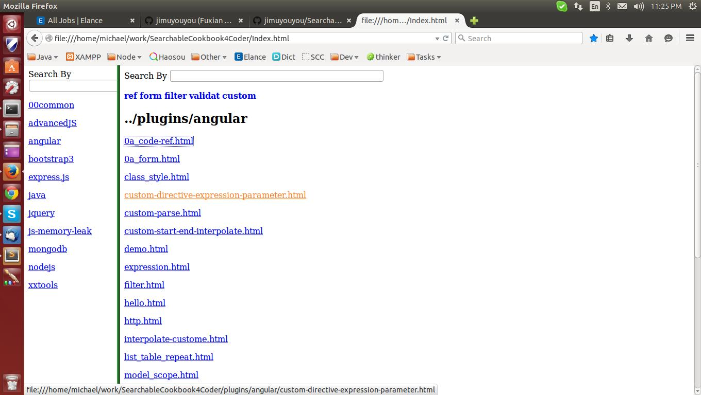

# SearchableCookbook4Coder
SearchableCookbook4Coder

<h3>Background</h3>
Computer techonolgies are growing fast, and there are at least 5 skills are needed in one real project. As a coder, it would be difficult for you to remember all statements exactly for one specified language. This may even worse when two programming languages have similar statements, but with huge differences in detail. 

I build this simple app to provide pluginable, searchable, runnable and copiable statements for coders.
 

<h3>Almost completed plugins/cookbook:</h3>

1. Javascript adavanced topics and memory leak

2. NodeJS

3. ExpressJS

4. AngularJS

5. JQuery selectors

6. Bootstrap

7. Mongodb

8. Java Jersey, Spring and Hiberante

<h3>Coming soon:</h3>

1. Better integrated pages for above skills

2. Html5

3. SocketIO

4. Mobile development

...

<h3>Note: You can also add/refine any documents to this project.</h3>

<h3>Setup:</h3>

1. git clone https://github.com/jimuyouyou/SearchableCookbook4Coder.git

2. click index.html to run

3. type any keyword in the search input field 

Screen shot:

<h3>Plugin development process:</h3>

1. Create a new folder under plugins, such plugins/PhoneGap

2. Add any pages to PhoneGap folder, preferabley html, but you can put any format

3. cd ../bin

4. ./refresh.sh 

This simple linux script will link PhoneGap as a new plugin listed as left bar, and all pages under PhongeGap will be composed to one file named PhoneGap/index.html as a link. Of course, it is searchable!

5. open index.html page again and you will be able to search what you have just created rapidly

<h3>Toolsets already implemented:</h3>

1. searchable link - a_search.js under lib folder

2. searchable table - table_search.js under lib folder

3. configurable quick search fields - pCfg.js under lib folder

<h3>License: MIT</h3>